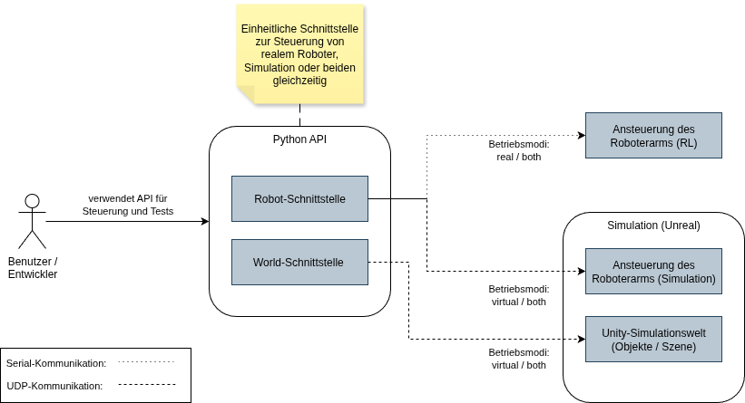

ifndef::imagesdir[:imagesdir: ../images]

// TODO: Anhand von Datenflüssen beschreiben wie das zu entwickelnde System eingesetzt wird.
// Also Daten, welche Benutzer oder umgebende Systeme in das zu entwickelnde System einspeisen oder abgreifen.
// Diese Beschreibung wird oft von einem Diagramm unterstützt. Dieses Diagram ist in VSK Pflicht!
// Hinweis: Hier unbedingt Benutzerschnittstellen und externe Schnittstellen mit Version spezifizieren.

[[section-system-scope-and-context]]
== System Scope and Context

=== Business Context

Das folgende Kontextdiagramm zeigt die wichtigsten Akteure, Systeme und Datenflüsse im Kontext des Projekts Digital Twind for MyPalletizer 260 M5 Unity Version. Es illustriert die Interaktionen zwischen dem Akteure und dem System sowie die Datenflüsse, die für die Funktionalität des Systems relevant sind. Dabei wird gut ersichtlich, dass die Archtiktur 4 verschiedene Schnittstellen aufweist, welche im Kapitel Technical Context genauer daruf eingegangen werden.

==== Akteuere und Interaktionen:

|===
| Akteur | Beschreibung | Interaktion mit dem System

| *Benutzer / Entwickler*
| Interagiert mit dem System über die bereitgestellte Python API. Dabei beinhaltet diese API alle wichtigen Funktionen, um den Roboterarm zu steuern. Zudem sind auch Funktionen beinhaltet, welche es ermöglichen, die Simulationsumgebung zu konfigurieren, um so verschiedene Szenarien mit verschienen Objekten zu erstellen. Dabei besistzt die API bereits 3 standart Szenarien, welche es ermöglichen, die Simulation schnell zu testen und zu nutzen. Es können aber auch eigene Szenarien erstellt werden, um so die Möglichkeiten der Simulation voll auszuschöpfen.
| - Roboterarm steuern

- Szenarien erstellen und nutzen
|===

Dabei ist in diesem Projekt der Benutzer gleichzeitig auch der Entwickler, da die Simulation hauptsächlich für Studenten und Fachleute entwickelt wurde, welche den Roboterarm in einer virtuellen Umgebung testen und optimieren können, bevor sie ihn in der realen Welt einsetzen. Es ist jedoch auch denkbar, dass die Simulation von Personen genutzt wird, welche sich für das Programmieren von Roboterarmen interessieren, aber keine formale Ausbildung in diesem Bereich haben. In diesem Fall könnte die Simulation als Lernplattform dienen, um die Grundlagen des Programmierens von Roboterarmen zu erlernen und zu experimentieren, ohne auf die physische Hardware angewiesen zu sein.

=== Geschäftsprozess (BPMN)
Die folgende BPMN darstellung zeigt die wichtigsten Prozesse, welche im Kontext des Projekts Digital Twind for MyPalletizer 260 M5 Unity Version relevant sind. Es illustriert die Interaktionen zwischen den verschiedenen Komponenten des Systems und die Datenflüsse, die für die Funktionalität des Systems relevant sind. Dabei wird gut ersichtlich, dass die Archtiktur 4 verschiedene Schnittstellen aufweist, welche im Kapitel Technical Context genauer daruf eingegangen werden.

image::FBS-BPMN.drawio.png[]

==== Kurzbeschreibung der Domänenprozesse
* **Gateway**: Entgegennahme von Kundenanfragen, Erfassung oder Suche des Kunden im System und Weiterleitung der Bestellung.
* **Order Service:** Prüft und verarbeitet eingehende Bestellungen, validiert Kundendaten, steuert Freigabe und Versand sowie Rechnungsstellung.
* **Inventory Service:** Verwalten der Lagerbestände, Prüfen von Artikelverfügbarkeiten und automatisches Auslösen von Nachbestellungen beim Zentrallager, sobald Mindestmengen unterschritten werden.
* **Customer Service:** Verwaltung und Pflege der Kundendaten. Er erstellt neue Kunden, prüft Mahnstatus und stellt Informationen für Bestellungen bereit.

=== Technical Context

Die folgende Tabelle zeight die technischen Schnittstellen des Filialbestellsystems (FBS). Die Kommunikation zwischen den Komponenten und Usern erfolgt über definierte Schnittstellen und Protokolle.

[cols="2,3", options="header"]
|===
| Schnittstelle | Beschreibung

| User → Gateway
| Abfragen von Informationen oder Ausführen von Aktionen.
Kommunikation erfolgt über eine *REST-API*.

| User → Services
| Benutzer interagieren nicht direkt mit den Services, sondern über das *Gateway*.

| Gateway → Services
| Abfragen von Informationen oder Ausführen von Aktionen.
Kommunikation erfolgt über *RabbitMQ*.

| Service → Service
| Kommunikation zwischen den Services.
Kommunikation erfolgt über *RabbitMQ*.

| Service → Storage
| Persistierung von Daten.
Die Daten werden in allen Services über *JPA Hibernate* in *MySQL*-Datenbanken gespeichert.
|===

=== Microservices Architecture

Das FBS ist in mehrere Microservices unterteilt, die jeweils eine spezifische Funktionalität bereitstellen.
Die Microservices kommunizieren über *RabbitMQ*.

image::FBS-service-diagram.drawio.png[]